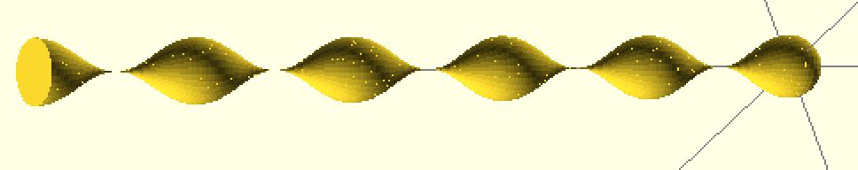

# 3D Raindrop Customizer

## raindrop3D( radius, height, steps, loops );

A script for [OpenSCAD](http://www.openscad.org/) optimized for performance on Thingiverse's [Customizer](customizer.makerbot.com).

You can use the customizer from [the Thingiverse page](http://www.thingiverse.com/thing:669233).

It's secretly just a cosine wave on a sphere.

Originally forked from the more linear [Raindrop by Twanne](http://www.thingiverse.com/thing:641626).
