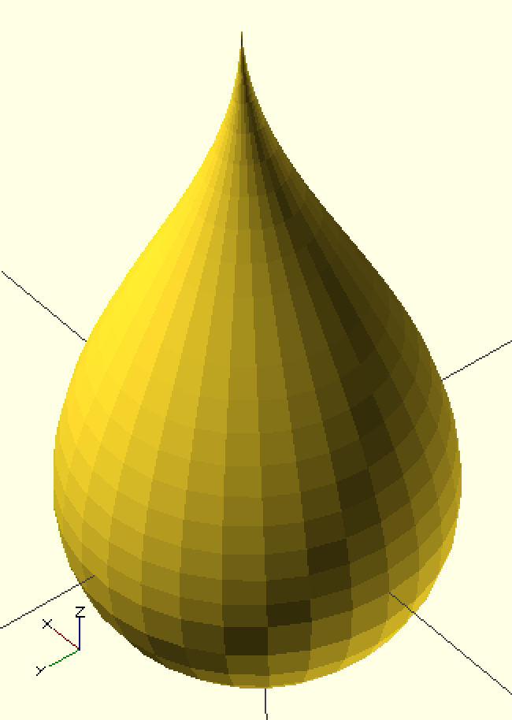

# 3D Raindrop Customizer

## raindrop3D( radius, height, steps, loops, facets );

A script for [OpenSCAD](http://www.openscad.org/) optimized for performance on Thingiverse's [Customizer](customizer.makerbot.com).

You can view a live model in your browser [on Sketchfab](https://sketchfab.com/models/89d43bb71fff49029793ca7abcb60a53).

You can use the customizer [on Thingiverse](http://www.thingiverse.com/apps/customizer/run?thing_id=669233&code=933b32d3288807d0e7c8d93575f9a3fe).

It's secretly just a cosine wave on a sphere.

Originally forked from the more linear [Raindrop by Twanne](http://www.thingiverse.com/thing:641626).
